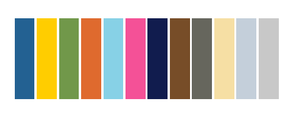

# CANHR Colors 

CANHR color scheme for **R** and **Stata**.

---

## R Package

### Installation

```r
# install.packages("devtools")
devtools::install_github("rdazadda/CANHR-color-schemes")
```

### Usage

```r
library(canhrcolors)

# All colors
barplot(1:12, col = canhrcolors())

# Single color
hist(rnorm(100), col = canhrcolors("blue"))

# ggplot2
library(ggplot2)
ggplot(iris, aes(Sepal.Length, Sepal.Width, color = Species)) +
  geom_point() +
  scale_color_canhr() +
  theme_canhr()
```

See [Basic Use](articles/basicuse.html) for more examples.

---

## Stata Scheme

### Installation

```stata
net install canhr, from("https://raw.githubusercontent.com/rdazadda/CANHR-color-schemes/main/")
```

### Usage

```stata
set scheme canhr

sysuse auto, clear
scatter mpg weight
graph bar (mean) mpg, over(foreign)
histogram mpg
```

See [Stata Usage](articles/stata.html) for more examples.

---

## Colors

<table>
<tr><th>Color</th><th>Hex</th><th>Preview</th></tr>
<tr><td>Blue</td><td>#236192</td><td><span style="display:inline-block;width:60px;height:20px;background:#236192;border-radius:3px;"></span></td></tr>
<tr><td>Gold</td><td>#FFCD00</td><td><span style="display:inline-block;width:60px;height:20px;background:#FFCD00;border-radius:3px;"></span></td></tr>
<tr><td>Green</td><td>#71984A</td><td><span style="display:inline-block;width:60px;height:20px;background:#71984A;border-radius:3px;"></span></td></tr>
<tr><td>Orange</td><td>#DF6A2E</td><td><span style="display:inline-block;width:60px;height:20px;background:#DF6A2E;border-radius:3px;"></span></td></tr>
<tr><td>Cyan</td><td>#87D1E6</td><td><span style="display:inline-block;width:60px;height:20px;background:#87D1E6;border-radius:3px;"></span></td></tr>
<tr><td>Magenta</td><td>#F45197</td><td><span style="display:inline-block;width:60px;height:20px;background:#F45197;border-radius:3px;"></span></td></tr>
<tr><td>Dark Blue</td><td>#111C4E</td><td><span style="display:inline-block;width:60px;height:20px;background:#111C4E;border-radius:3px;"></span></td></tr>
<tr><td>Brown</td><td>#774D28</td><td><span style="display:inline-block;width:60px;height:20px;background:#774D28;border-radius:3px;"></span></td></tr>
<tr><td>Dark Grey</td><td>#66665D</td><td><span style="display:inline-block;width:60px;height:20px;background:#66665D;border-radius:3px;"></span></td></tr>
<tr><td>Custard</td><td>#F6DFA4</td><td><span style="display:inline-block;width:60px;height:20px;background:#F6DFA4;border-radius:3px;"></span></td></tr>
<tr><td>Light Blue</td><td>#C4CFDA</td><td><span style="display:inline-block;width:60px;height:20px;background:#C4CFDA;border-radius:3px;"></span></td></tr>
<tr><td>Light Grey</td><td>#C8C8C8</td><td><span style="display:inline-block;width:60px;height:20px;background:#C8C8C8;border-radius:3px;"></span></td></tr>
</table>

---

Developed by the Numbers Team at CANHR - Center for Alaska Native Health Research
